## 👋 Hi, I'm Rachit

A Computer Science student at **UPES** (graduating **May 2027**) specialising in **DevOps**, with hands-on experience in **full stack development** and **cloud technologies**. I enjoy building scalable, useful software and automating the work around it.

> *"Turning ideas into reality through code"* 💻✨

---

## 🎯 Current Focus

| 🚀 Building | 📚 Learning | 🧩 Practicing | 🎯 Goals |
|:--|:--|:--|:--|
| Scalable web apps | Cloud computing | Data structures & algorithms | Master AWS |
| Full stack projects | DevOps practices | Competitive programming | Contribute to open source |
| Automation tools | System design | Problem solving | Build impactful solutions |

---

## 🛠️ Engineering Stack

**☁️ DevOps & Cloud**
 

**⚙️ Backend**
 

**🎨 Frontend**
 

**🗄️ Databases**
 

**🧰 Also worked with:** C · JDBC · Swing GUI

---

## 📊 GitHub Activity

---

## 🧩 Problem Solving

---

## 🌐 Connect

